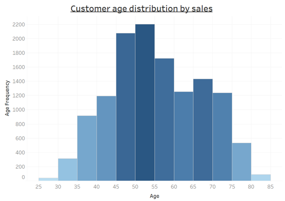
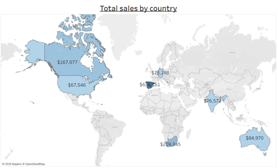
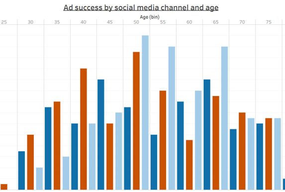

# customer-insights-marketing-analytics
Customer insights project using SQL, Tableau and Excel to analyse customer behaviour, purchasing patterns and marketing performance. Interactive dashboards help identify high-value customer segments, optimise targeting strategies and support revenue growth through data-driven decision-making.

# Using Customer Insights to Improve Marketing Performance and Revenue Growth

## Overview
This project explores how customer and marketing data can be used to better understand customer behaviour, identify high-value audiences and improve marketing effectiveness. By analysing purchasing patterns, demographics and campaign performance, I translated customer data into actionable insights to support growth and commercial decision-making.

## Business Problem
Understanding who your most valuable customers are, how they behave and which marketing channels influence them is essential for effective customer engagement and revenue growth.

The objective of this project was to identify high-value customer segments, understand purchasing behaviour and evaluate marketing channel effectiveness to support more targeted and effective marketing activity.

## Approach
- Cleaned and prepared customer, sales and marketing datasets
- Used SQL to explore customer behaviour and purchasing patterns
- Analysed demographic and geographic trends
- Evaluated marketing channel performance and lead conversions
- Developed interactive Tableau dashboards for stakeholder analysis
- Translated findings into business-focused recommendations

## Key Insights
- Customer spending varied significantly across demographic groups
- Purchasing behaviours differed across countries and customer segments
- Marketing channel effectiveness varied depending on customer age and profile
- Certain customer segments generated disproportionately higher revenue than others
- Customer and marketing insights highlighted opportunities for more targeted engagement

## Recommendations

- Prioritise developing a twitter marketing campaign targeting the highest-value customer segment, to increase lead conversions, with the goal of growing revenue by 7.5% following the campaign launch.
- Reduce reliance on dominant product categories by promoting complementary products, aiming to reduce alcohol sales share from 50% to 45% by the end of 2026.  

## Tools Used

SQL, Tableau, Excel, Customer Insights, Customer Segmentation, Marketing Analytics, Dashboard Development, Data Visualisation, Customer Behaviour Analysis, Commercial Analytics, Business Intelligence, Stakeholder Storytelling

## Key Visuals
### Customer Age Demographic
[

### Customer Country Demographic
[

### Marketing Performance
[

## What I'd Do Next
This analysis identified which customer segments and marketing channels performed best, but did not explain the motivations behind customer purchasing behaviour. As a next step, I would explore customer journeys in more detail to understand what drives engagement and conversion, helping to create more personalised marketing strategies and improve customer experience.
